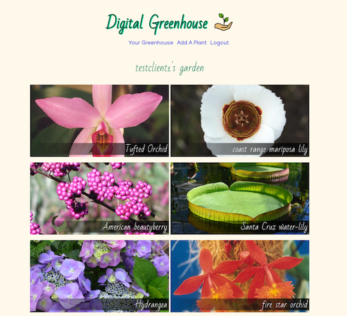
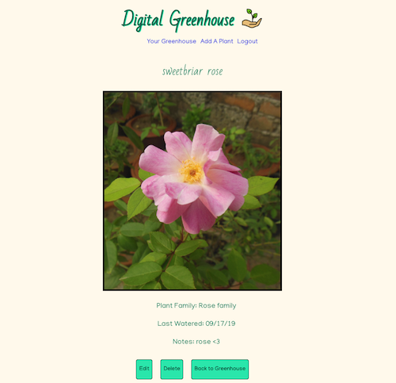

# DIGITAL GREENHOUSE

## Live App: https://digital-greenhouse.now.sh/
### Try it out:
login: testclient1@gmail.com

password: Password1

## API Docs
* Search request uses Trefle.io - web API providing a database of over 300,000 plants
* Express Server provides methods for account creation and login, as well as for getting all of a user's plants, adding plants to a user's list, and editing/deleting plants belonging to a user.

## Screenshots
User Page:

Plant Page:

## Summary
Digital Greenhouse provides an online space for you to manage your personal collection of plants. Create an account, search for your plants, and add them to your personal list. Save details such as plant family, last watered, images, and personal notes. You can also edit/remove plants from your list. Coming soon -- receive push notifications with reminders to water/feed your plants based on the schedule you define for each plant.

## Tech Used
* Front End: React.js, CSS
* Back End: Node.js, Express, PostgreSQL
